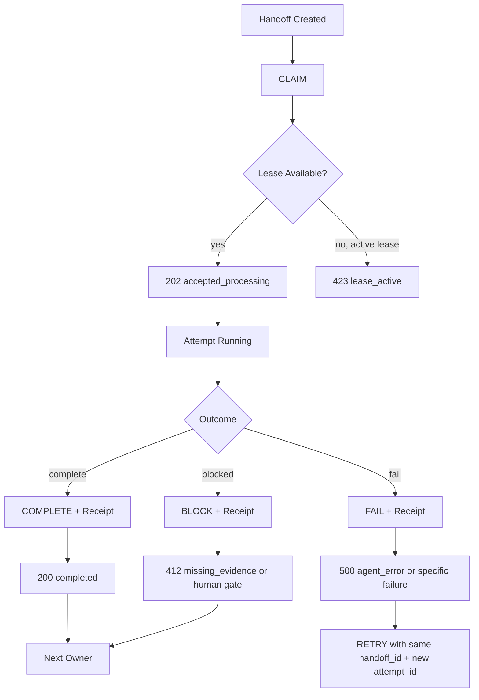

# SACP Packet Lifecycle

SACP/0.1 is a small transaction protocol.

它不是字段清单。它描述的是一次 agent 工作从请求、领取、执行、验证、回执到交接的生命周期。

## Minimal Lifecycle

```text
handoff created
-> claimed
-> lease active
-> attempt running
-> completed / failed / blocked
-> receipt produced
-> next owner assigned
```

## State Diagram



## Lifecycle Rules

### 1. Handoff Created

A handoff begins with a stable `handoff_id`.

The first packet should include:

- `protocol`
- `type`
- `method`
- `resource_type`
- `resource_id`
- `handoff_id`
- `attempt_id`
- `agent_id`
- `created_at`
- `source_fingerprint`
- `content_type`

### 2. Claim

`CLAIM` means an actor attempts to own the next execution attempt.

If lease is available:

```yaml
status_code: 202
status_text: accepted_processing
```

If another actor owns active lease:

```yaml
status_code: 423
status_text: lease_active
```

### 3. Attempt Running

While running, the agent may use tools, read sources, reason, and draft output. SACP/0.1 does not standardize internal thoughts.

Only the final receipt is protocol truth.

### 4. Complete

`COMPLETE` requires a receipt.

No receipt means no trusted completion.

### 5. Fail

`FAIL` means this attempt failed.

It should still produce a receipt explaining:

- what failed
- whether retry is safe
- next owner
- residual risk

### 6. Block

`BLOCK` means the agent must stop because it needs evidence, approval, missing input, permission, or human decision.

Common block reasons:

- missing evidence
- memory promotion approval absent
- public release decision needed
- source missing
- ambiguous instruction

### 7. Retry

`RETRY` starts a new `attempt_id` under the same `handoff_id`.

Retry does not create a new task.

If `handoff_id` is unchanged but `source_fingerprint` changes, the receiver should treat the packet as changed input or rework, not as `409 duplicate_handoff`.

Recommended result:

```yaml
status_code: 202
status_text: accepted_processing
```

unless required core fields are invalid.

### 8. Next Owner

Every terminal receipt must assign `next_owner`.

Accepted examples:

- `Human`
- `Coordinator`
- `AI-04`
- `ClaimReviewer`
- `MemoryReviewer`

Invalid examples:

- `someone`
- `later`
- empty value

## Terminal States

| Terminal State | Required Receipt? | Typical Code |
|---|---:|---|
| Completed | yes | `200 completed` |
| No action needed | yes or explicit no-op record | `204 no_action_needed` |
| Superseded by human decision | yes | `301 superseded_by_human_decision` |
| Invalid packet | diagnostic record | `400 invalid_packet` |
| Duplicate handoff | existing receipt or no-op record | `409 duplicate_handoff` |
| Missing evidence | yes | `412 missing_evidence` |
| Agent error | yes if possible | `500 agent_error` |
| Lease expired | diagnostic record | `504 lease_expired` |

## Lifecycle Invariants

- Same `handoff_id` means same work request.
- New `attempt_id` under same `handoff_id` means retry or reassignment.
- Changed `source_fingerprint` means rework, not simple duplicate.
- Lease is not completion.
- Completion without receipt is invalid.
- Pending memory is not verified memory.
- Human decision overrides agent preference.
