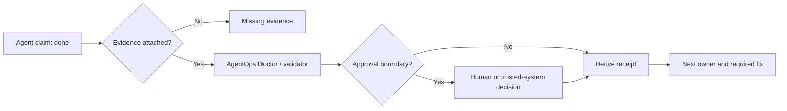

# SACP: Scalable Audit and Control Protocol for AI Agents

> No receipt, no trust.

SACP is an open, text-first protocol for auditing long-horizon AI agent work.

As agents move from single replies to tool use, memory, delegation, and multi-step workflows, final-answer evaluation is no longer enough. SACP makes the intermediate work auditable: what was claimed, what evidence supports it, who owns the next step, whether memory was promoted safely, and where human approval is required.

It does not replace LangGraph, MCP, A2A, OpenClaw, or agent SDKs. It adds a small audit layer:

```text
When an agent says "done", it should produce a checkable work receipt.
```

AgentOps Doctor is the first reference tool in this repo. Paste in messy agent output, and it returns a status code, claim findings, missing evidence, next owner, required fix, and a translated SACP receipt.

## Why This Exists

Modern agent failures often happen before the final answer:

- a subagent accepts a task but loses the original goal;
- a model claims tests passed without showing command output;
- a memory item is promoted from inference to "verified fact";
- a tool result is summarized without preserving evidence;
- a handoff says "done" but leaves no owner for the next step.

SACP turns these failures into auditable work records. The protocol is intentionally small: Markdown/YAML packets, local validators, dirty-run cases, and example receipts that can be inspected by humans and tools.

## The Core Loop



SACP does not decide whether the underlying task is true by itself. It makes the claim, evidence, approval boundary, current status, and next owner visible enough for a human or trusted system to check.

## Why OpenAI Models And Codex Matter

SACP is model-agnostic, but OpenAI models and Codex are a natural testbed because coding agents already perform long-horizon work: reading files, editing code, running tests, delegating subtasks, and reporting completion. API credits would be used to turn this repo into a stronger open-source evaluation harness:

- develop the reference implementation, validators, examples, and docs with Codex;
- run GPT-based agent workflows and translate them into SACP receipts;
- test failure modes such as memory drift, delegated task drift, missing evidence, and tool-use audit gaps;
- compare baseline agent outputs against SACP-instrumented workflows;
- publish reproducible logs, benchmark tasks, and cost summaries.

See:

- [Research proposal](./docs/research-proposal.md)
- [OpenAI Codex Fund plan](./docs/openai-codex-fund-plan.md)

Chinese version: [README.zh-CN.md](./README.zh-CN.md)

## 3-Minute Quick Start

```bash
git clone https://github.com/aDragon0707/sacp.git
cd sacp
python agentops-doctor-skill/agentops_doctor.py agentops-doctor-skill/examples/done_but_no_receipt.md
```

Expected output includes:

```text
status_code
status_text
receipt_completeness
claim_findings
memory_warning
next_owner
human_decision_required
required_fix
translated_receipt
```

Try a missing-evidence example:

```bash
python agentops-doctor-skill/agentops_doctor.py agentops-doctor-skill/examples/unsupported_test_claim.md
```

Validate protocol examples:

```bash
python validator.py --examples --strict
```

## Try It With Your Own Agent Output

The fastest useful experiment is to save one real final answer, worklog, or handoff and run AgentOps Doctor on it:

```bash
python agentops-doctor-skill/agentops_doctor.py path/to/your-agent-output.md
```

Then open a GitHub issue with a sanitized copy if the diagnosis is wrong, incomplete, or catches a useful failure. Do not include secrets, customer data, private paths, or proprietary logs. The goal is one concrete failure case, not a star request.

Read the public-safe adoption case:

- [Longju SACP Runtime Guard](./ADOPTION_CASE_LONGJU.md)

## Receipt Chain For Long-Running Agent Work

Receipt Chain is an optional SACP profile for long-running work, multi-module work, multi-agent handoff, and cross-model continuation. It does not schedule agents. It preserves auditable work state between them.

Read: [SACP_RECEIPT_CHAIN.md](./SACP_RECEIPT_CHAIN.md), [Chinese version](./SACP_RECEIPT_CHAIN.zh-CN.md), [multi-agent project example](./examples/receipt_chain_multi_agent_project.yaml), and [research publish example](./examples/receipt_chain_research_publish.yaml).

## Protocol Design References

SACP borrows protocol discipline from HTTP, Git, OpenTelemetry, MIME, and RFC-style normative wording, but stays a small audit protocol. See [PROTOCOL_DESIGN_REFERENCES.md](./PROTOCOL_DESIGN_REFERENCES.md).

## Local Demo Page

Open [sacp-demo.html](./sacp-demo.html) directly in a browser to see a static explanation of what SACP changes: raw completion claims become auditable receipts with evidence, next owner, and human decision boundaries.

Open [sacp-triage-editor.html](./sacp-triage-editor.html) to triage the current project into Now / Next / Later / Cut and copy the next Codex prompt.

## Test Your Own Agent Output

Save any final agent response, worklog, or handoff as a text file:

```bash
echo "Done. All tests passed. Ready to publish." > my-agent-output.md
python agentops-doctor-skill/agentops_doctor.py my-agent-output.md
```

AgentOps Doctor does not execute the original task. It checks whether the output is auditable:

- Did it claim completion without a receipt?
- Did it claim tests passed without command output?
- Did it promote memory without approval?
- Did it identify the next owner?
- Did it cross a human decision boundary?

## What Is In This Repo

```text
SACP = protocol
AgentOps Doctor = reference skill / CLI
Dirty Run = adversarial state-discipline benchmark
validator.py = local reference checker
```

Core docs:

- [STATUS.md](./STATUS.md): current project status and community ask
- [SPEC.md](./SPEC.md): protocol semantics
- [ENVELOPE.md](./ENVELOPE.md): envelope fields and examples
- [RECEIPT.md](./RECEIPT.md): receipt fields and examples
- [STATUS_CODES.md](./STATUS_CODES.md): status codes
- [DIRTY_RUN_CASES.md](./DIRTY_RUN_CASES.md): adversarial cases
- [CONFORMANCE.md](./CONFORMANCE.md): conformance levels
- [PROTOCOL_EVOLUTION.md](./PROTOCOL_EVOLUTION.md): how feedback becomes dirty cases, extensions, profiles, and core candidates
- [JSON_SCHEMA_PLAN.md](./JSON_SCHEMA_PLAN.md): docs-only plan for v0.2 JSON Schema
- [SACP_RECEIPT_CHAIN.md](./SACP_RECEIPT_CHAIN.md): optional profile for long-running, multi-agent work
- [docs/OPENCLAW_LONGJU_ADAPTER_NOTE.md](./docs/OPENCLAW_LONGJU_ADAPTER_NOTE.md): docs-only OpenClaw / Longju adapter mapping
- [docs/ADAPTER_NOTE_TEMPLATE.md](./docs/ADAPTER_NOTE_TEMPLATE.md): docs-only mapping template for agent frameworks
- [docs/SACP_AGENT_TEST_PROMPT.md](./docs/SACP_AGENT_TEST_PROMPT.md): prompt for OpenClaw, herness, or another agent to test SACP
- [docs/DUAL_AGENT_TRIAL_RUNBOOK.md](./docs/DUAL_AGENT_TRIAL_RUNBOOK.md): two-agent trial workflow and result table
- [docs/DUAL_AGENT_TRIAL_RESULT_TEMPLATE.md](./docs/DUAL_AGENT_TRIAL_RESULT_TEMPLATE.md): coordinator template for comparing OpenClaw and herness reports
- [agentops-doctor-skill/](./agentops-doctor-skill): one-command reference tool
- [examples/](./examples): valid and dirty packets
- [sample-corpus/](./sample-corpus): messy outputs translated into SACP receipts
- [ADOPTION_CASE_LONGJU.md](./ADOPTION_CASE_LONGJU.md): public-safe local adoption case
- [COMMUNITY_OUTREACH.md](./COMMUNITY_OUTREACH.md): community sharing and feedback prompts
- [OUTBOUND_PR_PLAYBOOK.md](./OUTBOUND_PR_PLAYBOOK.md): maintainer outreach and docs-only PR playbook
- [SOCIAL_LAUNCH_PACKET.md](./SOCIAL_LAUNCH_PACKET.md): X, Reddit, Hacker News, and Chinese community launch copy
- [SACP_OUTBOUND_HANDOFF_2026-05-17.md](./SACP_OUTBOUND_HANDOFF_2026-05-17.md): continuation packet for outbound official PR work

## Real Adoption Case

SACP/0.1 has been tested as a local state layer for Longju, a single-agent operator running in an OpenClaw-style workspace.

The adoption used a file-based `.sacp/` ledger and a runtime guard with four gates:

```text
PreTask -> ContextCheck -> PreExternalAction -> PostTask
```

The public-safe trials covered false completion, prompt injection, skill distillation, and duplicate handoffs:

```text
false completion      -> 412 missing_evidence
prompt injection      -> human approval required
skill distillation    -> candidate only, no automatic promotion
duplicate handoff     -> 204 no_action_needed
```

Read the case study: [ADOPTION_CASE_LONGJU.md](./ADOPTION_CASE_LONGJU.md)

## Concrete Example

Raw agent output:

```text
Done. All tests passed. I saved the user preference to verified memory.
```

SACP breaks that into separate audit questions:

```text
1. "Done" without a receipt is not enough.
2. "All tests passed" needs command output or evidence.
3. "verified memory" requires human or trusted-system approval.
```

Likely diagnosis:

```text
412 missing_evidence
required_fix: attach test output, downgrade unsupported claims, require human approval for memory promotion.
```

SACP is not about making the model smarter. It is about making agent work state, evidence, ownership, and decision boundaries explicit.

## When To Use It

- You are building an agent skill and want to check whether its output is acceptable.
- You run multi-agent workflows and need handoff, attempt, receipt, and next-owner discipline.
- You compare models or frameworks and want to audit their completion claims.
- You collect hallucination, missing evidence, and memory-pollution examples.
- You want AI work to move from chat logs toward auditable work records.

## How To Contribute

The most useful contributions are concrete:

- Submit a messy agent output.
- Report a bad AgentOps Doctor diagnosis.
- Propose a Dirty Run case.
- Add adapter notes for LangGraph, CrewAI, MCP, A2A, OpenClaw, or another framework.
- Improve docs so new developers can run the project faster.

Open an issue using the templates in this repo.

See [CONTRIBUTING.md](./CONTRIBUTING.md).

If you want to share the project with developer communities, see [COMMUNITY_OUTREACH.md](./COMMUNITY_OUTREACH.md).

For a staged, consent-aware outreach process, see [OUTREACH_1000_PLAN.md](./OUTREACH_1000_PLAN.md). It tracks public projects and community contacts by use case and feedback state; it is not a list of scraped personal email addresses.

## Boundary

SACP helps agents produce auditable work receipts.

It does not guarantee correctness.

AgentOps Doctor audits the output. It does not execute the underlying task.

SACP/0.1 is an experimental alpha. The next useful step is more messy outputs, adapter examples, and adversarial test cases.
