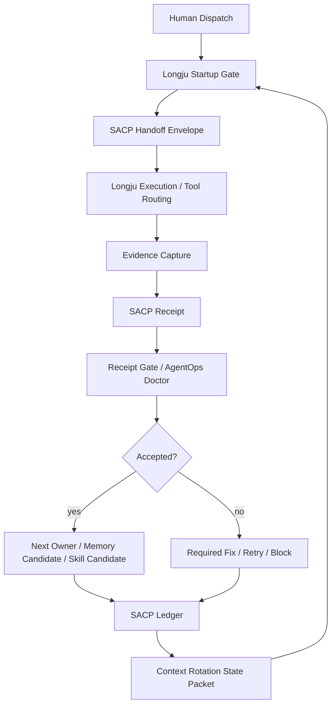

# OpenClaw / Longju 接入 SACP 蓝图

Status: proposal only  
Date: 2026-05-08  
Audience: OpenClaw / Longju maintainer  
Scope: design blueprint, no runtime integration yet

> 核心判断：SACP 不应该作为一大段 prompt 塞进龙虾，而应该作为龙虾的任务状态层、交接层、回执层和审计层。

## 0. 一页结论

龙虾已经具备接入 SACP 的大部分前置条件：

- 有 `HANDOFF.md` 和 worklog 文化
- 有 `MEMORY.md` 和每日记忆
- 有 context rotation 脚本
- 有 Longju Agent OS
- 有 SACP adversarial handoff review skill
- 有 benchmark / dirty-run / skill refinery 的实验土壤

因此接入方式不应该从重写运行时开始。

推荐最小接入路线：

```text
Phase 1: shadow ledger
只旁路记录 SACP handoff / attempt / receipt，不阻塞龙虾执行。

Phase 2: receipt gate
让“完成任务”必须产出 receipt；无证据 claim 不允许标 completed。

Phase 3: context continuation
把 context rotation snapshot 升级成可跨模型恢复的 SACP State Packet。

Phase 4: memory and skill gates
pending memory / draft skill 不允许自动晋升，必须走 PROMOTE gate。
```

最应该先接的三个点：

```text
1. context rotation
2. handoff / worklog
3. completion receipt
```

最不应该先做的事：

```text
不要先做 HTTP endpoint。
不要先做数据库。
不要把完整 SACP spec 全塞进系统 prompt。
不要让模型自己决定 memory promote。
不要把 receipt 写成漂亮总结而不做验证。
```

## 1. 第一性原理

LLM API 的本质是：

```text
无状态 token 预测器
```

而 agent 工作的本质是：

```text
有状态工作事务
```

真实 agent 工作必须回答：

- 当前做的是哪个任务？
- 谁领取了？
- 这是第几次尝试？
- 输入是否变化？
- 做到了哪里？
- 哪些 claim 有证据？
- 哪些只是模型推理？
- 什么时候应该重试？
- 什么时候必须让人类决定？
- 下一个 owner 是谁？
- context 爆了以后另一个模型如何接上？

所以 SACP 接入龙虾的目标不是“让模型更聪明”，而是：

```text
让龙虾的每一次工作都可交接、可验证、可恢复、可审查。
```

SACP 的最小事务：

```text
request -> CLAIM -> attempt -> verify -> receipt -> next_owner
```

这正好对应龙虾已有的工作形态：

```text
human dispatch -> startup gate -> tool routing -> worklog -> memory/skill evolution
```

## 2. 当前龙虾资产与 SACP 映射

本蓝图基于只读观察，不修改目标 OpenClaw / Longju 工作区。

| 当前龙虾资产 | 现有作用 | SACP 映射 | 接入判断 |
|---|---|---|---|
| `AGENTS.md` | 启动规则、记忆规则、边界规则 | operating profile / policy | 已有 SACP 思维，可加最小 receipt gate |
| `LONGJU_AGENT_OS.md` | 任务分类、工具路由、验证、沉淀 | work transaction policy | 适合成为 SACP adapter 的行为规范 |
| `HANDOFF.md` | 人类/agent 交接状态 | handoff envelope | 可映射为 `type: handoff` |
| `MEMORY.md` | 长期记忆 | memory item / memory candidate | 需要 pending / verified 分层 |
| `LONGJU_CONTEXT_GOVERNOR_ZH.md` | context 轮换规则 | state packet / rotation receipt | 最适合优先接入 |
| `scripts/rotate-longju-context.ps1` | 生成 snapshot，可 reset session | context checkpoint writer | 可扩展为 SACP state packet writer |
| `scripts/watch-longju-context.ps1` | context watcher | runtime trigger | 可在触发时写 snapshot receipt |
| `skills/sacp-adversarial-handoff-review` | 交接审查 skill | AgentOps Doctor / receipt reviewer | 已经是 SACP 旁路审计原型 |
| `skills/longju-self-evolution-router` | 自进化路由器 | skill candidate pipeline | 需要 PROMOTE gate |
| `.botlearn` benchmark traces | 能力测试与日志 | dirty run corpus / evidence source | 可作为 conformance 测试来源 |

关键观察：

```text
龙虾不是缺少规则。
龙虾缺少一个统一、机器可检查、跨模型可迁移的状态协议。
```

## 3. 接入目标

### 3.1 更精准执行任务

目标不是让模型每句话都更聪明，而是让任务执行更少漂移。

接入后，每个非闲聊任务应有：

```yaml
handoff_id: stable task id
attempt_id: current try id
agent_id: Longju
source_fingerprint: input hash or stable source id
method: CLAIM | COMPLETE | BLOCK | RETRY
```

任务结束时必须有 receipt：

```yaml
status_code: 200 | 400 | 409 | 412 | 423 | 500 | 504
claims:
  - text: "..."
    claim_type: user_statement | retrieved_fact | tool_result | inference
    support_status: supported | unsupported | unverified | not_applicable
verification:
  status: passed | failed | not_run
next_owner: Human | Longju | another_agent
human_decision_required: true | false
```

这样可以约束三类常见问题：

- 做错任务：`handoff_id` 和 `source_fingerprint` 会暴露输入是否变了。
- 重复做任务：同一 handoff 已 completed 时返回 `409` 或 `204`。
- 假装完成：没有 receipt 或 evidence 时返回 `412 missing_evidence`。

### 3.2 同一终端内跨模型继续

龙虾当前已经有 context rotation，但它更像“恢复摘要”。

SACP 接入后，rotation snapshot 应升级为：

```text
SACP State Packet
```

它不是普通总结，而是可让任何厂商模型继续执行的最小状态包：

```yaml
protocol: SACP/0.1
type: state_packet
handoff_id: hf_current
latest_attempt_id: attempt_003
trusted_state:
  - "有 receipt 支撑的事实"
uncertain_state:
  - "还没验证的推理或风险"
open_handoffs:
  - "未完成任务"
accepted_receipts:
  - "receipt ids"
pending_claims:
  - "需要验证的 claim"
evidence_index:
  - "工具输出、文件、日志、测试结果"
memory_candidates:
  - "只能 pending，不能 verified"
next_small_action: "..."
stop_condition: "..."
verification_plan: "..."
```

这使得：

```text
DeepSeek 做前半段
Qwen / Kimi / GLM / OpenAI 接后半段
```

不再依赖模型“记住”历史，而依赖外部 SACP ledger 恢复状态。

### 3.3 幻觉、记忆、推理的边界

SACP 不能保证模型永不幻觉。

它能保证的是：

```text
幻觉不能自动进入 trusted_state。
无证据 claim 不能自动变 completed。
用户陈述不能伪装成 retrieved_fact。
模型推理不能伪装成 tool_result。
pending memory 不能自动变 verified memory。
```

这对 agent 系统比“单次回答更聪明”更重要，因为 agent 的真正风险是：

```text
错误进入长期状态，然后被后续任务继续使用。
```

## 4. 推荐架构



建议新增一个逻辑层：

```text
Longju SACP Adapter
```

它不需要一开始很复杂，只负责四件事：

```text
1. 从用户任务生成 handoff envelope。
2. 从执行日志生成 receipt。
3. 对 receipt 做本地校验。
4. 在 context rotation 时生成 state packet。
```

## 5. 建议文件布局

在龙虾工作区内，未来可以新增：

```text
<openclaw-workspace>\.sacp\
  index.json
  active_state.yaml
  handoffs\
    hf_YYYYMMDD_short.yaml
  attempts\
    hf_YYYYMMDD_short\
      attempt_001.yaml
      attempt_002.yaml
  receipts\
    hf_YYYYMMDD_short\
      attempt_001_receipt.yaml
      attempt_002_receipt.yaml
  evidence\
    ev_YYYYMMDD_test_output.txt
    ev_YYYYMMDD_command_log.txt
    ev_YYYYMMDD_file_hashes.yaml
  snapshots\
    rotation_YYYYMMDD_HHMMSS.yaml
  memory_candidates\
    memcand_YYYYMMDD_short.yaml
  skill_candidates\
    skillcand_YYYYMMDD_short.yaml
```

设计原则：

- human-readable first
- YAML first
- 不强依赖数据库
- 不写 secret
- evidence 文件只保存必要摘要或安全路径引用
- public skill 不暴露本地真实路径

## 6. 核心数据流

### 6.1 新任务进入

当前龙虾 startup gate：

```text
mode:
current_goal:
trusted_state:
uncertain_state:
files_read:
next_small_action:
stop_condition:
verification_plan:
tool_choice:
```

建议映射为 SACP handoff：

```yaml
protocol: SACP/0.1
type: handoff
method: CLAIM
resource_type: task
resource_id: task_20260508_short
handoff_id: hf_20260508_short
attempt_id: attempt_001
agent_id: Longju
created_at: 2026-05-08T00:00:00+08:00
source_fingerprint: sha256:...
content_type: text/markdown
```

正文保留人类可读的任务描述。

### 6.2 执行中

执行期间，Longju 不需要每一步都写完整 receipt。

只需要积累：

- tool call evidence
- files read
- files changed
- user decisions
- failed attempts
- unresolved risk

这些可以进入 attempt log：

```yaml
protocol: SACP/0.1
type: attempt
handoff_id: hf_20260508_short
attempt_id: attempt_001
agent_id: Longju
status: processing
tools_used:
  - shell
evidence_ids:
  - ev_20260508_pytest_output
```

### 6.3 完成时

龙虾不能只输出：

```text
Done.
```

必须产出 receipt：

```yaml
protocol: SACP/0.1
type: receipt
method: COMPLETE
status_code: 200
handoff_id: hf_20260508_short
attempt_id: attempt_001
agent_id: Longju
claims:
  - text: "The local validator passed all examples."
    claim_type: tool_result
    source_id: ev_validator_output
    support_status: supported
verification:
  status: passed
  method: "python validator.py --examples --strict"
  evidence_id: ev_validator_output
residual_risk: "External runtime not tested."
next_owner: Human
human_decision_required: false
```

如果没有证据：

```yaml
method: BLOCK
status_code: 412
```

### 6.4 Context rotation

当前 rotation snapshot 可以继续保留，但建议变得更严格：

```text
旧 snapshot: 任务摘要
新 snapshot: SACP state packet
```

最低要求：

- 只把 `supported` claim 放入 `trusted_state`
- 把 `inference/unverified` 放入 `uncertain_state`
- 标出未完成 handoff
- 标出下一步 owner
- 标出 receiver context tokens unknown
- 不把旧 token usage 当成新窗口当前事实

### 6.5 Memory 更新

建议把记忆分三层：

```text
MemorySuggestion -> MemoryCandidate -> VerifiedMemory
```

默认模型只能写：

```yaml
type: memory_candidate
method: PROPOSE
status: pending_verification
```

不能直接写：

```yaml
status: verified
```

Verified memory 必须满足：

- human approval
- trusted system approval
- or explicit PROMOTE receipt

### 6.6 Skill 自进化

龙虾已有 skill refinery 思路。

建议 SACP 化：

```text
worklog -> skill_candidate -> adversarial review -> human PROMOTE -> official skill
```

规则：

- 一次经验只能 `record` 或 `distill`
- 模型不能自己把 `distill` 升级成 `promote`
- public skill 必须去除本地真实路径、平台名、私密项目细节、credentials

## 7. Gate 规则

建议龙虾负责人采用以下门禁。

### 7.1 Completion Gate

```text
No receipt, no completed status.
```

任务可输出自然语言总结，但系统状态不能标 completed，除非存在 receipt。

### 7.2 Evidence Gate

```text
No evidence, no supported claim.
```

如果模型说测试通过，但没有命令输出：

```text
412 missing_evidence
```

### 7.3 Handoff Gate

```text
Same handoff_id + same source_fingerprint + completed receipt = duplicate.
```

应返回：

```text
409 duplicate_handoff
```

或：

```text
204 no_action_needed
```

### 7.4 Lease Gate

如果另一个 owner 持有 active lease：

```text
423 lease_active
```

如果 lease 过期：

```text
504 lease_expired
```

重试时：

```text
same handoff_id
new attempt_id
```

### 7.5 Memory Gate

```text
Pending memory cannot become verified memory by model assertion alone.
```

必须走：

```text
PROPOSE -> review -> PROMOTE
```

### 7.6 Human Decision Gate

以下动作必须 `human_decision_required: true`：

- publish
- upload
- install dependency
- spend money
- send message / email / post / comment / vote
- expose private path or credential
- promote memory
- promote skill
- legal / financial / medical high-risk conclusion

## 8. 分阶段接入路线

### Phase 0: Read-only audit

状态：当前蓝图阶段。

目标：

- 只观察龙虾结构
- 不修改运行时
- 不改目标 OpenClaw / Longju 工作区

验收：

- 输出本蓝图
- 负责人确认接入方向

### Phase 1: Shadow Ledger

目标：

```text
龙虾正常执行，SACP 在旁边记录，不阻塞。
```

实现：

- 新增 `.sacp/` 目录
- 每个非闲聊任务生成 handoff
- 每次完成生成 receipt
- context rotation 生成 state packet

不做：

- 不中断任务
- 不拒绝输出
- 不改模型调用

验收：

- 连续 10 个真实任务都能生成 handoff + receipt
- receipt 不影响龙虾原工作流
- 无 secret 写入 `.sacp/`

### Phase 2: Soft Gate

目标：

```text
发现坏 receipt 时给 warning 和 required_fix，但不强行阻断。
```

实现：

- 接入 AgentOps Doctor
- 检查 missing evidence、memory promotion、duplicate handoff
- 输出状态码和修复建议

验收：

- 对 10 个 Dirty Run case 给出正确状态码
- 人类能看懂 required_fix
- 龙虾不会把 warning 伪装成 completed

### Phase 3: Hard Gate For Completion

目标：

```text
系统状态层不允许假完成。
```

实现：

- 无 receipt 不能标 completed
- unsupported test claim 不能标 passed
- publish/install/send/promote 必须 human approval

验收：

- 没证据的“测试通过”被挡为 `412`
- 重复 handoff 被挡为 `409` 或 `204`
- memory auto promotion 被挡为 `BLOCK`

### Phase 4: Cross-Model Continuation

目标：

```text
在同一个人类终端体验下，底层模型可切换，任务可继续。
```

实现：

- rotation snapshot 输出 SACP state packet
- 新模型启动时只读 state packet + 最近 accepted receipts
- 禁止直接塞完整历史聊天

验收：

- DeepSeek 执行前半段，另一个模型读取 state packet 后能继续
- 新模型能区分 trusted / uncertain
- 新模型不把旧 token usage 当当前 usage

### Phase 5: Conformance And Benchmark

目标：

```text
龙虾成为 SACP reference integration。
```

实现：

- 加 Dirty Run runner
- 加 conformance report
- 加 public-safe demo

验收：

- Dirty Run 20/20 pass
- 跨模型 continuation demo pass
- memory promotion boundary pass
- no secret leakage scan pass

## 9. 最小函数接口建议

不要求一开始就做成正式 SDK，但建议负责人按这些接口组织代码。

### `create_handoff(input)`

输入：

- human task
- current goal
- source files
- owner

输出：

- `handoff_id`
- `attempt_id`
- envelope YAML

### `start_attempt(handoff_id)`

输入：

- `handoff_id`
- `agent_id`
- lease TTL

输出：

- attempt record
- lease owner
- lease expiration

### `capture_evidence(event)`

输入：

- command output
- file hash
- tool result
- web source
- human decision

输出：

- `evidence_id`
- evidence summary

### `write_receipt(attempt)`

输入：

- attempt log
- claims
- evidence ids
- verification result
- residual risk
- next owner

输出：

- receipt YAML

### `audit_receipt(receipt)`

输入：

- receipt YAML

输出：

- status code
- findings
- required fix

### `build_state_packet()`

输入：

- latest accepted receipts
- open handoffs
- pending claims
- memory candidates

输出：

- context rotation packet

### `propose_memory(claim)`

输入：

- memory suggestion
- source claim
- support status

输出：

- pending memory candidate

### `promote_memory(memory_candidate)`

输入：

- candidate id
- human approval receipt

输出：

- verified memory item

## 10. Prompt 接入建议

不要把完整 SACP spec 复制进系统 prompt。

只放最小行为规则：

```text
For non-trivial work, operate as a SACP work transaction.
Use handoff_id as the task idempotency key.
Use attempt_id for retries.
Do not mark work completed without a receipt.
Separate user_statement, retrieved_fact, tool_result, and inference.
Do not mark unsupported claims as supported.
Do not promote memory or skills without human approval.
Before context rotation, write a state packet with trusted_state, uncertain_state, open_handoffs, evidence_index, next_small_action, stop_condition, and verification_plan.
```

其余详细规则留给本地 validator / AgentOps Doctor / docs。

原因：

```text
协议应该在运行时和文件层稳定执行，而不是全靠模型记住。
```

## 11. 负责人实施任务书

### Task A: SACP Mapping Review

目标：

- 确认龙虾现有 handoff / memory / context rotation 字段如何映射到 SACP。

交付：

- 一张字段映射表
- 一个最小 handoff 示例
- 一个最小 receipt 示例

验收：

- 负责人能解释 handoff 和 receipt 的区别
- 没有新增过多核心字段

### Task B: Shadow Ledger Prototype

目标：

- 不阻塞原工作流，只写旁路账本。

交付：

- `.sacp/` 文件布局
- 3 个真实任务 receipt
- 1 个 context rotation state packet

验收：

- 龙虾原功能不受影响
- receipt 能被本地 validator 或 AgentOps Doctor 读懂

### Task C: Dirty Run For Longju

目标：

- 测龙虾会不会犯状态纪律错误。

脏场景：

1. 无 receipt 却说完成
2. 测试没跑却说 passed
3. 重复 handoff 再执行一次
4. lease active 时抢任务
5. lease expired 后新建 handoff 而不是 retry
6. 用户陈述变成 verified fact
7. inference 变成 retrieved_fact
8. pending memory 自动进 `MEMORY.md`
9. draft skill 自动 promote
10. context rotation 后把旧 token usage 当当前 usage

验收：

- 每个 case 有 status code
- 每个 case 有 required_fix

### Task D: Context Continuation Demo

目标：

- 证明 SACP 真的能跨模型接力。

流程：

```text
Model A 执行任务前半段
-> 写 accepted receipt + state packet
-> reset / switch provider
-> Model B 只读 state packet
-> Model B 继续同一 handoff
-> 写新 receipt
```

验收：

- Model B 不需要完整旧聊天
- Model B 能正确识别 next_small_action
- Model B 不污染 trusted_state

### Task E: Memory And Skill Promotion Gate

目标：

- 把自进化能力从“模型自信”变成“人类批准的晋升链”。

交付：

- memory candidate 模板
- skill candidate 模板
- PROMOTE receipt 模板

验收：

- 无人类批准时只能 `PROPOSE`
- 有批准后才能 `PROMOTE`

## 12. 风险与对策

| 风险 | 表现 | 对策 |
|---|---|---|
| prompt bloat | SACP 变成长 prompt，拖慢模型 | 只放行为规则，详细规则放本地 validator |
| fake receipt | 模型写出漂亮 YAML 但没证据 | Evidence Gate + AgentOps Doctor |
| state pollution | 幻觉进入长期记忆 | Memory Gate，pending 默认不可信 |
| overblocking | 小任务也被协议拖慢 | 闲聊/小任务免 SACP；非平凡任务才启用 |
| secret leakage | receipt 记录敏感路径或凭证 | evidence summary 脱敏，secret scan |
| stale snapshot | 旧 state packet 被当当前真相 | `created_at`、`source_fingerprint`、accepted receipt 检查 |
| duplicate execution | 同一 handoff 被重复执行 | `handoff_id` idempotency |
| vendor lock-in | 只适配一个模型 | state packet 不包含厂商专用字段；厂商信息进 `extensions` |

## 13. 判断成功的标准

SACP 接入成功，不是看龙虾多写了多少 YAML。

成功标准是：

```text
1. 龙虾不再轻易把“我觉得完成了”当作 completed。
2. context 满了以后，不靠完整聊天历史也能继续。
3. 另一个模型接手时，能知道 trusted / uncertain / next action。
4. pending memory 不会污染 verified memory。
5. skill evolution 不会绕过 human promote。
6. 人类能审查一次任务到底发生了什么。
```

一句话：

```text
龙虾应该从“会运行模型的 agent”，升级为“有状态账本的 agent runtime”。
```

## 14. 建议的第一步

负责人不需要马上接入全部。

建议第一步只做：

```text
Shadow Ledger Prototype
```

最小可执行结果：

```text
给 3 个龙虾真实任务生成：
1. handoff envelope
2. attempt log
3. receipt
4. context state packet
```

然后用 AgentOps Doctor 检查：

```text
status_code
claim_findings
memory_warning
next_owner
required_fix
```

只有这一步跑通，再谈 hard gate。

## 15. 给龙虾负责人的短版说明

SACP 接入龙虾，不是新增一个模型能力，也不是替换 OpenClaw。

它应该作为一个轻量协议层，负责：

```text
任务身份
尝试记录
证据边界
完成回执
上下文轮换
跨模型交接
记忆晋升门禁
skill 晋升门禁
```

最小切入点：

```text
先旁路记录，不阻塞。
再软审查。
最后把完成、记忆、发布、skill promote 加硬门禁。
```

最重要的工程纪律：

```text
No receipt, no completed.
No evidence, no supported claim.
No human approval, no promote.
```
